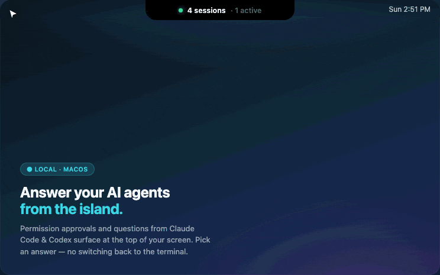
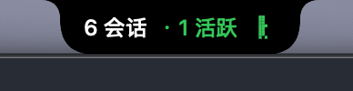

<div align="center">

# DevIsland

**Answer your AI coding agents from a Dynamic-Island-style overlay — without switching back to the terminal.**

把本机 AI 编程会话的"选择时刻"(权限批准、AskUserQuestion 提问)聚合到 macOS 顶部的"动态岛",**就地点选作答**。


<!-- 头条视觉:动态岛就地作答的演示动画。 -->


</div>

## What it does / 是什么

**The problem:** every time Claude Code asks for permission or pops an `AskUserQuestion`, you have to dig back to *that* terminal tab to answer it — and it only gets messier once several sessions are running at once.

DevIsland is a pure-Swift macOS app that lives in a Dynamic-Island-style overlay at the top of your screen (no Dock icon, no menu-bar item). It watches your local AI coding sessions (Claude Code, Codex) and surfaces their **decision moments** — permission approvals and `AskUserQuestion` prompts — onto a Dynamic-Island-style overlay at the top of your screen. **Answer right there, on the island, without switching tabs.** All local file IPC: no network, no account.

---

**痛点:** 每次 Claude 要权限、或抛出一个 `AskUserQuestion`,你都得翻回*那个*终端标签去找它——会话一多就更乱。

DevIsland 是一个纯 Swift 的 macOS 应用,常驻在屏幕顶部的"动态岛"悬浮面板里(无 Dock 图标、无菜单栏图标),监控本机正在运行的 AI 编程工具会话(Claude Code、Codex)。当某个会话需要你**做选择**时——批准一次权限、或回答一个 `AskUserQuestion`——请求会浮现到岛上,你**直接点选**即可,不必切回那个终端标签。全程本地文件 IPC,不联网、无账号。

平时收起成屏幕顶部的小胶囊,一眼看到活跃会话数与状态;点击展开成完整列表(即上方头图)。



## Features / 功能

只列**实测可用**的(✅);部分可用与未实现的分开标注,绝不混淆。

**✅ 可用**
- **岛上权限批准** —— Claude Code 的权限确认浮到岛上,点「允许 / 拒绝」代替去终端按 y(基于官方 PermissionRequest hook)
- **AskUserQuestion 就地作答** —— 单选点选即提交、多选勾选 + 提交,答案直接回灌给会话,不用切回终端
- **多会话监控** —— 同时识别多个 Claude Code / Codex 会话;以转录文件路径为唯一标识 + 进程计数配对,**同一项目开多个会话也不会混**
- **会话详情** —— 最近消息流、当前动作、状态(运行中 / 在提问 / 已回复);Claude Code 与 Codex 信息量基本对齐
- **项目看板** —— 会话行的 📊 打开该项目的 `.board/board.html`。看板是**开放约定**:任意位于 `<项目>/.board/board.html` 的自包含 HTML 都会被渲染,与用哪个 agent 无关。随仓附带的 `update-board` 技能让 **Claude Code 或 Codex** 一句话「更新看板」生成它(`install_hooks.sh` 会装到两者的技能目录)
- **打包 DMG** —— `build_app.sh` / `package_dmg.sh`

**⚠️ 部分可用 / 有已知边界**
- **终端精确跳转**:Terminal.app / iTerm2 可精确定位标签;Ghostty / Warp / VSCode 只能激活 App(终端本身无定位接口)
- **同 cwd 跨多终端的配对**:CLI 不暴露 sessionId,跨终端时按启发式配对,可能标错归属
- **配额显示**:Codex 为真实 5h/7d 用量;Claude 仅能判断登录模式 + 本地累计今日 token(非官方配额)
- **显示上限**:跨所有工具最多同时显示 12 个会话

**🗺️ 路线图(未实现)**
- 更多 agent:Gemini CLI / Cursor / OpenCode …
- 计划 / 变更的 Markdown 预览
- 基于 Notification/Stop hook 的主动推送(替代当前 2 秒轮询)
- 8-bit 音效、SSH 远程监控、首次启动零配置

## Requirements / 环境

- macOS 14 (Sonoma) 及以上
- Swift 5.10+ / Xcode(从源码构建)
- 可选:Claude Code(启用「岛上批准 / 就地作答」需要)

## Install / 安装

### 下载预编译版(推荐)

到 [Releases](https://github.com/swifter09/DevIsland/releases) 下载最新 `DevIsland-<版本>.dmg`,打开后把 **DevIsland** 拖进 **Applications**。

> ⚠️ **首次打开**:DMG 未做 Apple 公证,macOS 会提示"无法验证开发者"。**右键 app →「打开」**确认一次即可(仅首次);或在终端执行一次:
> ```bash
> xattr -dr com.apple.quarantine /Applications/DevIsland.app
> ```

### 从源码构建

```bash
git clone git@github.com:swifter09/DevIsland.git
cd DevIsland

swift run                     # 开发期直接跑
# 或自己打包:
./scripts/build_app.sh        # 产出 dist/DevIsland.app
./scripts/package_dmg.sh      # 产出 dist/DevIsland-<版本>.dmg
```

启动后:屏幕顶部中央出现"动态岛"胶囊(无 Dock、无菜单栏图标);点击展开成会话列表,展开态右上角有 ＋(新建会话)、⚙(设置)等入口;胶囊可拖动。

## Usage / 用法:启用岛上作答

让 Claude Code 的权限确认与提问出现在岛上:

```bash
./scripts/install_hooks.sh   # 装 hook 到 ~/.devisland/、配置写入 ~/.claude/settings.json(自动备份)、看板技能装到 Claude/Codex 技能目录
```

然后在 DevIsland 菜单面板打开「岛上批准」开关。**新开的** Claude Code 会话即生效(已有会话需重启,让它重新读取 settings)。

## How it works / 原理

全程本地文件 IPC,不联网:

```
Claude Code ──hook──▶ devisland-gate.py
                         │  写 ~/.devisland/requests/<id>.request.json
                         ▼
                  DevIsland 轮询发现 ──▶ 岛上弹出请求卡
                         ▲                    │ 用户点选(允许/拒绝 或 选答案)
                         │ 读 <id>.response.json ◀┘
                         ▼
                  输出决定/答案 JSON ──▶ Claude Code 放行/拒绝/带着答案继续
```

- **权限批准**走 `PermissionRequest` hook,输出 `permissionDecision`(官方能力)。
- **AskUserQuestion 就地作答**走 `PreToolUse` hook,把岛上选的答案以 `updatedInput.answers` 回灌。

**安全兜底(出问题绝不卡住你):** 以下任一情况,hook 都不输出决定、交回终端正常的权限/提问流程——
- 「岛上批准」开关没开
- DevIsland 没在运行(心跳文件超过 10 秒未更新)
- 权限请求 45 秒无响应 / 提问 5 分钟无响应(此后自动回退到终端)

**卸载:** 删掉 `~/.claude/settings.json` 里对应的 hook 配置,以及 `~/.devisland/` 目录即可,不留残留。

## 架构

```
Sources/DevIsland/
├── DevIslandApp.swift          # 入口:accessory App(无 Dock/菜单栏图标,空 Settings 占位)
├── AppDelegate.swift           # 创建悬浮面板、启动监控
├── Models/                     # AgentSession / PermissionRequest
├── Services/
│   ├── SessionMonitor.swift    # 监控器协议:每种 AI 工具一个实现
│   ├── ClaudeCodeMonitor.swift # 扫描 ~/.claude/projects 的转录
│   ├── CodexMonitor.swift      # 扫描 ~/.codex/sessions
│   ├── SessionStore.swift      # 汇总所有监控器,UI 唯一数据源
│   └── ApprovalService.swift   # 权限/作答:与 hook 的文件 IPC
└── Views/                      # IslandView(动态岛) / 菜单面板 / 看板
hooks/devisland-gate.py         # Claude Code hook(权限网关 + 就地作答)
scripts/install_hooks.sh        # 安装 hook + 合并 settings.json
```

新增工具监控:实现 `SessionMonitor` 协议(扫描该工具的本地会话文件),在 `SessionStore.startMonitoring()` 注册即可。

## Contributing / 贡献

见 [CONTRIBUTING.md](CONTRIBUTING.md)。Issue 和 PR 都欢迎。

## License

MIT © 2026 swifter09
